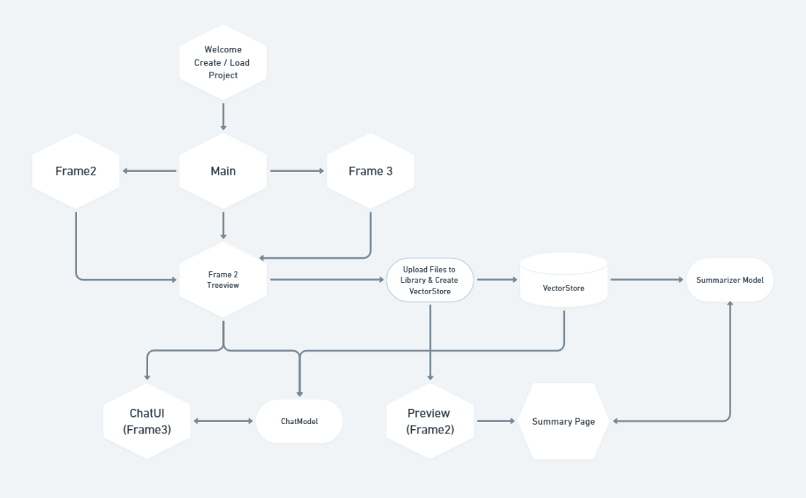

# Research Assistant

## Demo: [YouTube](https://www.youtube.com/watch?v=ZvhKDMrs6zM&ab_channel=Arbash)

 


## Overview

Research Assistant is a powerful tool designed to assist researchers in managing, summarizing, and interacting with research papers. It provides functionalities for organizing documents, generating summaries, and interacting with a chat model to answer questions based on the content of the documents.

## Features

- **Document Management**: Organize research papers, summaries, and notes.
- **PDF Viewer**: View and interact with PDF documents.
- **Summarization**: Generate summaries for research papers using advanced language models.
- **Chat Interface**: Ask questions and get answers based on the content of your documents.

## Project Architecture



## Project Structure

---

    ```
        .
        ├── __pycache__/
        ├── logs/
        │   └── running_logs.log
        ├── main.py
        ├── projects.json
        ├── README.md
        ├── requirements.txt
        ├── settings.py
        ├── src/
        │   ├── __init__.py
        │   ├── components/
        │   │   ├── __init__.py
        │   │   ├── chat.py
        │   │   ├── pdf_viewer.py
        │   │   ├── text_editor.py
        │   │   └── treeview.py
        │   ├── config/
        │   │   └── themes.py
        │   ├── constants.py
        │   ├── exceptions/__init__.py
        │   ├── logger/__init__.py
        │   ├── rag/
        │   │   ├── __init__.py
        │   │   ├── components/
        │   │   │   ├── chat_model.py
        │   │   │   ├── process_files.py
        │   │   │   ├── prompts.py
        │   │   │   └── summarizer_model.py
        │   └── utils/
        │       ├── __init__.py
        │       ├── common.py
        ├── venv/
        └── app.py

    ```

## Installation

1. **Clone the repository**:

```sh
git clone https://github.com/CC-KEH/research-assistant.git
cd research-assistant
```

2. **Activate virtual environment**:

```sh
conda create -p venv Python 3.10.14
```

3. **Install dependencies**:

```sh
pip install -r requirements.txt
```

4. **Run the application**:

```sh
python welcome.py
```

## Usage

1. **Create a New Project**:
    - Launch the application and follow the prompts to create a new project.
    - Enter the project name and select the directory where the project will be created.

2. **Load an Existing Project**:
    - Select a previously created project from the list to load it.

3. **Manage Documents**:
    - Use the treeview to organize your research papers, summaries, and notes.
    - Add, delete, and view documents directly within the application.

4. **Generate Summaries**:
    - Select a PDF document and generate a summary using the built-in summarization model.

5. **Interact with the Chat Model**:
    - Use the chat interface to ask questions and get answers based on the content of your documents.

## Contributing

We welcome contributions from the community! Here’s how you can get involved:

## Code of Conduct

We expect all contributors to adhere to our [Code of Conduct](CODE_OF_CONDUCT.md). Please read it to understand the standards of behavior we expect from our community.

## License

This project is licensed under the MIT License. See the LICENSE file for more details.

## Contact

If you have any questions or need further assistance, feel free to open an issue or contact the maintainers.

---

Thank you for contributing to Research Assistant! Together, we can make research easier and more efficient for everyone.
